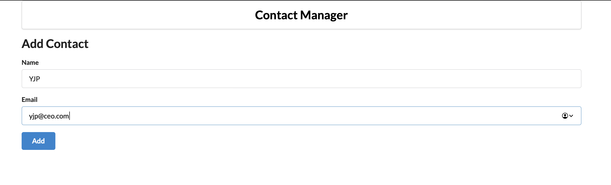

# Simple Contact Manager Learned from YouTube

This project was my first react project ever. 
In this project, I learned how to store data into local browser storage, 
generate ID for the user, add, delete and view the contact.

While I'm learning, I got the concept of how react works. 
It made a strong base for me to complete my FYP in diploma studies.

Here are some pictures about this project.

    
    
    
    

